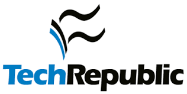

Thanks for stopping by!

 
I am Xinya Du (pronounced as _shinn-ya do_, 杜辛亚), a CS Ph.D. student at Cornell University, working with Prof. [Claire Cardie][claire]. 

 
I am working on natural language processing and machine learning, 
with a current focus on question answering and question generation. I graduated with a bachelor degree from Shanghai Jiao Tong University.
<!-- or fall 2015, I am  pursuing an research internship at Cornell NLP group, working with Prof. [Claire Cardie](http://www.cs.cornell.edu/home/cardie/).   -->
 
<!-- I am interested in machine learning, natural language processing and algorithmic game theory. Particularly, I am exciting about discovering exciting problems and devising core techniques. Here is my CV</a>. 
 -->
<!-- *** -->

<!--   -->
<!-- Book a meeting with [me][youcanbookme]!  -->

<!--   -->
<!-- **Attending EMNLP 2017 in Copenhagen from Sep. 7 --- Sep. 11, PM if you are interested in talking :)!** -->

 
 

### News 
* Arp. 2017 One paper accepted to EMNLP.
* Mar. 2017 One paper accepted to ACL!

<!-- * Aug. 2016 Started my Ph.D. study at Cornell University.  -->
<!-- * Feb. 2016 Attended LTI's Open House at Carnegie Mellon University.  -->

 

### Publications

Identifying Where to Focus in Reading Comprehension for Neural Question Generation   
**Xinya Du** and Claire Cardie  
*In EMNLP 2017.*  
[[bib]][important-bib] [[paper][emnlp17]] [[presentation][emnlp17_poster]]   

 
Learning to Ask: Neural Question Generation for Reading Comprehension  
**Xinya Du**, Junru Shao and Claire Cardie  
*In ACL 2017.*  
[[bib]][qg-bib] [[arXiv][qg-arxiv]] [[presentation][acl17_poster]] [[data & code][qg-github]]  
 Featured in [*New Scientist*][newsci] [][newsci] [*Tech Republic*][techrepublic] [][techrepublic]  

[claire]: https://www.cs.cornell.edu/home/cardie/

<!-- ACL 17 -->

[qg-arxiv]:https://arxiv.org/abs/1705.00106
[qg-bib]: bibs/acl2017qg.bib
[qg-github]: https://github.com/xinyadu/nqg
[acl17_poster]: papers/acl17_dsc_poster.pdf
[techrepublic]: http://www.techrepublic.com/article/how-researchers-trained-one-ai-system-to-start-asking-its-own-questions/
[newsci]: https://www.newscientist.com/article/2130205-inquisitive-bot-asks-questions-to-test-your-understanding/

<!-- EMNLP 17 -->

[emnlp17]: papers/emnlp17_dc.pdf
[emnlp17_poster]: papers/emnlp17_dc_poster.pdf
[important-bib]: bibs/emnlp17important.bib

[youcanbookme]: https://xinya.youcanbook.me/

 
 
 
 
 
 
 

<!--  -->

